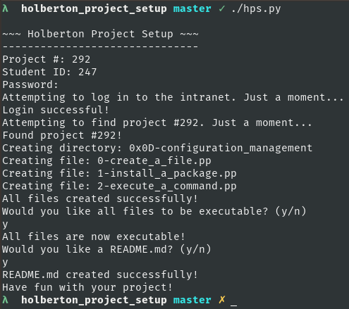
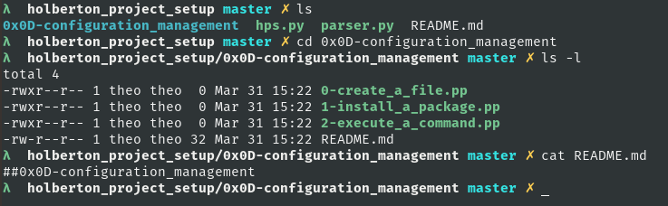

## Holberton Project Setup
**Automation tool for Holberton School projects**

- Tired of typos in your file names that lead to missed checks?
- Tired of forgetting to make a README?
- Tired of your files not being executable?

Then you can use this tool to do all of that work for you!

### Usage
All you need to do is enter the Project # (found in the project's URL), 
Student ID, and password. The script will do the rest. After creating the files
you will be prompted for two additional options: Whether or not you want a
README, and whether or not you want your files to be executable.

The new directory will be created in your current working directory and it will
be full of all files required for the mandatory tasks.

Then, if needed, you can `mv the_directory where_you_want_it`.

### Features
- Interactive CLI
- Generates all mandatory files for a project
- Hides password when you type it in
- Generates a README with the name of the project inside of it (optional)
- Automatically makes all project files executable (optional)

### Requirements

