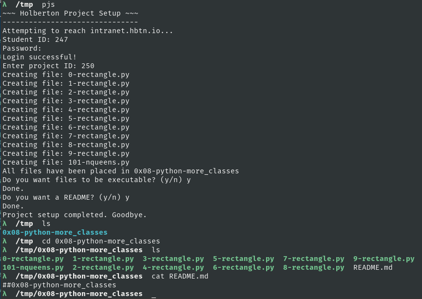

## Holberton Project Setup
**Automation tool for Holberton School projects**

- Tired of typos in your file names that lead to missed checks?
- Tired of forgetting to make a README?
- Tired of your files not being executable?

This tool does all the initial work of setting up your project so you can avoid
those mistakes and save yourself some time.

### Requirements
- python3
- BeautifulSoup (`sudo pip3 install bs4`)
- Requests (`sudo pip3 install requests`)

### Get Started
1. `git clone https://github.com/eightlimbed/holberton_project_setup.git`
2. `./pjs`

### Updates from ver1
- Calling it `pjs` now because I think it sounds better that 'hps', plus its
  easy to type.
- No more selenium, less dependencies, more lightweight. Now we are using `requests.Session()` to do everything in a session in order to pass the required `authenticity_token` with the username and password.
- Now works with "special projects" like airbnb clone.
